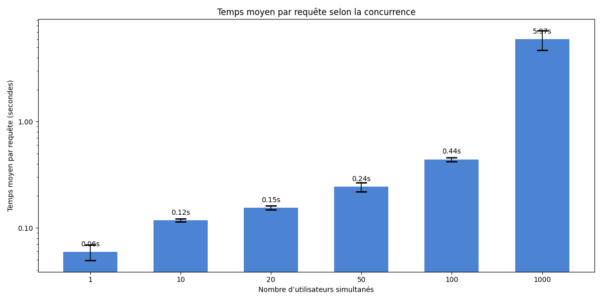
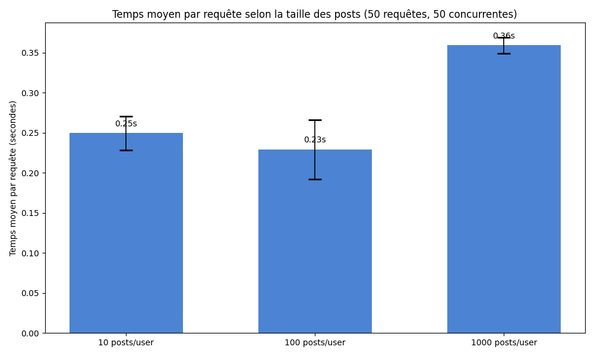

# DataAndCloudProject — Résultats du benchmark TinyInsta

Lien de la webapp : [tiny-insta](https://tinyinsta-benchmark.ew.r.appspot.com/) 

Présentation des résultats CSV présents dans le dossier `out/`. Pour chaque expérience
 :
- Un tableau reprenant les lignes du CSV correspondant aux valeurs en provenance de  `out/`),
- L'image du graphe associé.

**Remarque** : j'ai utilisé `hey` (heybenchmark) au lieu d'ApacheBench (`ab`) parce que `ab` provoquait des timeouts sur mes tests. J'ai aussi modifié sur mon `google cloud console` le fichier `seed.py` pour qu'il insère plus rapidement dans les tables. Pour finir, le fichier `reset_tables.py` a été utilisé pour vider les tables `Post` et `User`. J'ai utilisé un script python qui utilise `asyncio` pour gérer le parralélisme des requêtes.

## Concurrence (`out/conc.csv`)

Paramètres CSV :
| PARAM | AVG_TIME | RUN | FAILED |
|---:|---:|---:|---:|
| 1 | 58.790171 | 1 | 0 |
| 1 | 56.354456 | 2 | 0 |
| 1 | 58.870938 | 3 | 0 |
| 10 | 275.573301 | 1 | 0 |
| 10 | 253.105996 | 2 | 0 |
| 10 | 255.876499 | 3 | 0 |
| 20 | 253.241969 | 1 | 0 |
| 20 | 259.843746 | 2 | 0 |
| 20 | 260.654418 | 3 | 0 |
| 50 | 332.069559 | 1 | 0 |
| 50 | 327.036626 | 2 | 0 |
| 50 | 329.091950 | 3 | 0 |
| 100 | 621.635210 | 1 | 0 |
| 100 | 626.274089 | 2 | 0 |
| 100 | 1507.057411 | 3 | 0 |
| 1000 | 5793.259862 | 1 | 0 |
| 1000 | 5994.470221 | 2 | 0 |
| 1000 | 6624.679375 | 3 | 0 |

Graphe associé :

## Taille des posts (`out/post.csv`)

Paramètres CSV :

| RUN | AVG_TIME | FAILED |
|---:|---:|---:|
| 1 | 296.363276 | 0 |
| 2 | 302.325786 | 0 |
| 3 | 299.847851 | 0 |
| 1 | 356.433575 | 0 |
| 2 | 349.396688 | 0 |
| 3 | 353.280024 | 0 |
| 1 | 327.134374 | 0 |
| 2 | 305.451821 | 0 |
| 3 | 303.773398 | 0 |

Graphe associé :

## Fanout / followees (`out/fanout.csv`)

 Paramètres CSV :

| RUN | AVG_TIME | FAILED |
|---:|---:|---:|
| 1 | 309.738523 | 0 |
| 2 | 311.650689 | 0 |
| 3 | 336.177380 | 0 |
| 1 | 8432.654651 | 0 |
| 2 | 8432.417249 | 0 |
| 3 | 8272.648992 | 0 |
| 1 | 16336.609924 | 0 |
| 2 | 15549.078632 | 0 |
| 3 | 15771.376526 | 0 |

Graphe associé :

## Conclusion

On constate qu'avec ce benchmark, que le fanout et la concurrence impactent beaucoup les performances, et qu'au contraire le nombre de posts est négligeable malgré l'énorme quantité de posts que l'on a insérée pour l'expérience.

Cela démontre donc que ce programme `tiny-insta` est en **Fanout-Read** : Lorsque l'on affiche la timeline d'un utilisateur, on récupère tous ses followees, puis on trie lesquels on va afficher et enfin on les renvoie. 

#### Remarque :

Lors du benchmark, il y a eu beaucoup de soucis liés aux temps d'exécution ; parfois ils étaient anormalement longs, j'ai donc dû par moment vider l'ensemble des tables, et retirer les index, puis remettre le tout en ordre. De plus, avec seulement 3 runs par barplot, la quantité de données peut ne pas être suffisante pour représenter fidèlement les temps d'exécution, en d'autres termes, certaines valeurs ne sont peut-être pas représentatives des vraies performances associées à la webapp.